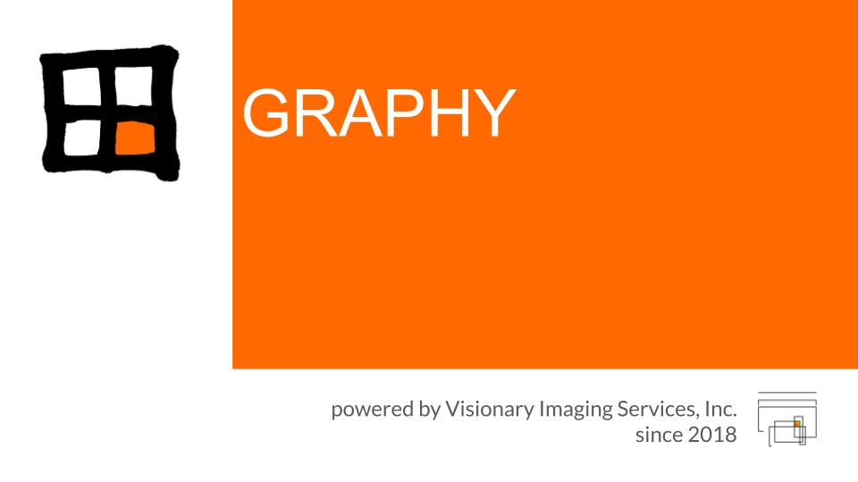
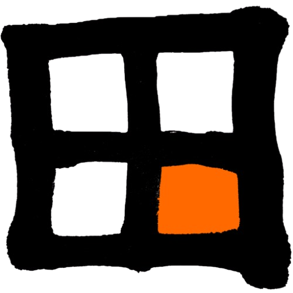

<p align="center">
  
</p>

<h1 align="center">
  
  GRAPHY-Next
</h1>

Java Swing の DICOM ワークステーション **GRAPHY** の Web 化（リファクタリング版）。
Spring Boot バックエンド ＋ React フロントエンドを、**Web アプリ** と
**Electron デスクトップアプリ** の 2 モードで動かす。

> 詳細設計は [`fw/`](fw/) を参照（`fw/HANDOFF.md` が起点）。開発計画は
> [`fw/development-phases.md`](fw/development-phases.md)。

## 主な機能

**画像ビューア**
- **2D ビューア** — スタック表示、W/L プリセット、シネ、輝度校正（HU / SUV を一元管理）。
- **MPR** — 直交 3 断面のリスライス。ガントリチルト対応。
- **Slicer** — 任意角オブリークのリスライス → セカンダリシリーズとして保存。
- **Curved MPR** — 芯線に沿った 3 種の CPR（ストレッチ / ストレートン / 回転アンフォールド）。
- **3D ビューア（VTK.js）** — ボリューム/サーフェスレンダリング、シネマティックレンダリング
  （WebGL2 散乱 ＋ パストレーサ）、3D 計測・3D カット・Undo、芯線解析、
  内視鏡パス編集、ROI ↔ メッシュ変換、メッシュ修復、方向ギズモ。

**解析・定量**
- **ROI / マスク** — 2D ROI 描画・管理、マスク塗り。
- **SUV 校正** — PET の SUV 換算（body weight ほか）。
- **Fusion オーバーレイ** — PET/CT 等のフュージョン（LUT 継承・オーバーレイ W/L 上書き）。
- **テクスチャ解析（Radiomics）** — バックエンド RadiomicsJ 連携（設定 UI）。

**データ管理・通信**
- DICOM 保管庫（H2 ＋ ファイルシステム）、DIMSE（C-STORE SCP 等）、DICOMweb、REST。
- **Query / Retrieve**、リモート AE 送信、非 DICOM（動画等）取り込み。
- プラグイン機構、環境設定 / システム / ヘルプメニュー、日英 i18n。

> 座標・計測の実装方針は
> [`fw/cornerstone-3d-geometry-caveat.md`](fw/cornerstone-3d-geometry-caveat.md) を必読
> （3D ジオメトリは自前の患者 LPS mm 幾何で計算、cornerstone は表示のみ）。

## 構成

```
backend/    Spring Boot (Java 21)  — profile: web / standalone
frontend/   React + TypeScript + Vite — UI 全体
desktop/    Electron — standalone backend を spawn して UI をラップ
fw/         設計ドキュメント（ソース・オブ・トゥルース）
scripts/    開発起動・バージョン更新スクリプト
```

| モード | 構成 | backend profile |
|---|---|---|
| Web アプリ | ブラウザ + backend（外部 PACS via DICOMweb/BFF） | `web` |
| デスクトップ | Electron + backend（ローカル H2/FS） | `standalone` |

`GET /api/status` がアクティブな profile とバージョンを返し、UI（ステータスバー /
環境設定＞情報）に表示される。新機能は原則 standalone 前提、web 対応は機能ごとに後追い。

## 必要環境

- JDK 21 / Maven 3.6.3+
- Node.js 20+ / npm

## インストール / 起動（配布物）

### スタンドアロン版（デスクトップ / Electron）

[Releases](../../releases) から OS 別インストーラを入手して実行するだけ。バックエンド
（H2 ＋ ファイルシステム）・Java ランタイム・ffmpeg をすべて同梱するので、追加インストールは不要。

| OS | 成果物 | 備考 |
|---|---|---|
| Windows | `GRAPHY-Next Setup <ver>.exe`（NSIS） | 実行してインストール |
| macOS | `GRAPHY-Next-<ver>.dmg` | マウントして Applications へ |
| Linux | `GRAPHY-Next-<ver>.AppImage` | `chmod +x` して実行 |

初回起動時にローカルへデータ保管フォルダ / H2 データベースを作成する。DICOM 受信(SCP)・
ローカル保管・全ビューア機能がオフラインで動作する（`standalone` プロファイル）。

保存データ（DICOM 保管庫・H2 データベース・plugins）は OS 標準のユーザーデータ領域
`GRAPHY-Next/` に作成される（インストール先ではなくユーザー領域なので、アンインストール時に
巻き添えで消えない）:

| OS | データ保管場所 |
|---|---|
| Windows | `%APPDATA%\GRAPHY-Next` |
| macOS | `~/Library/Application Support/GRAPHY-Next` |
| Linux | `~/.config/GRAPHY-Next` |

#### アンインストール

アプリ内の **Help ＞ アンインストール（Uninstall）** に、OS 別のアンインストーラの場所と手順を
表示する。いずれも保存データは**既定で保持**され、削除するかどうかは確認のうえ選べる（誤削除防止）。

| OS | アンインストーラ / 手順 |
|---|---|
| Windows | 「設定 ＞ アプリ ＞ GRAPHY-Next ＞ アンインストール」。ウィザードが保存データも削除するか確認する |
| macOS | GRAPHY-Next.app をゴミ箱へ。保存データも消すには同梱スクリプト `Contents/Resources/uninstall/uninstall-macos.command` を実行 |
| Linux | `.AppImage` を削除。保存データ / デスクトップ統合も消すには同梱スクリプト `resources/uninstall/uninstall-linux.sh` を実行 |

#### 更新の確認

起動時に GitHub Releases の最新版を確認し、新しいバージョンがあればダイアログで通知する
（メニュー **Help ＞ 更新を確認（Check for updates）** から手動確認も可能）。通知のみで、
入れ替えは新しいインストーラを実行しての**上書きアップグレード**（データは保持）で行う。
「このバージョンをスキップ」を選ぶと、その版は起動時に再通知しない。

> 参照リポジトリは `desktop/config.json` の `update.repo`。CSP の都合で最新版の取得は
> Electron の main プロセス経由（`api.github.com`）で行う。差分ダウンロードを伴うアプリ内
> 自動更新（electron-updater）は、コード署名体制の整備後に追加予定。

### Web 版（dcm4chee 連携）

Web 版は **UI 同梱 jar を `web` プロファイルで起動**し、外部 PACS（**dcm4chee**）に
**DICOMweb（QIDO/WADO）** で接続する BFF。GRAPHY 自身は画像を保管せず、dcm4chee 側の
Study を参照表示する。

**前提**: JDK 21 ／ Docker（dcm4chee 用）。jar は Releases の `graphy-next-backend.jar`、
または `cd backend && mvn -B clean package` で生成。

**1) dcm4chee-arc を起動**（同梱 compose）

```bash
docker compose -f deploy/dcm4chee/docker-compose.yml up -d
# 初回は WildFly 初期化に数分。UI: http://localhost:8080/dcm4chee-arc/ui2/
```

DICOMweb ベース URL: `http://localhost:8080/dcm4chee-arc/aets/DCM4CHEE/rs`
（テストデータ投入・停止手順など詳細は [`deploy/dcm4chee/README.md`](deploy/dcm4chee/README.md)）

**2) GRAPHY-Next（web）を起動**

dcm4chee が 8080 を使うため、GRAPHY 側は**別ポート（例: 8090）**で起動し、接続先を指定する:

```bash
java -jar graphy-next-backend.jar \
  --spring.profiles.active=web \
  --server.port=8090 \
  --graphy.dicom.dicomweb.base-url=http://localhost:8080/dcm4chee-arc/aets/DCM4CHEE/rs
```

> 恒久設定にするなら `backend/src/main/resources/application-web.yml` の
> `graphy.dicom.dicomweb.base-url`（必要なら `bearer-token`）に記載する。

**3) ブラウザでアクセス**: <http://localhost:8090/>（`GET /api/status` の mode が `web`）

## クイックスタート（開発）

```bash
make install        # frontend / desktop の依存をインストール

# デスクトップモード開発（Electron ウィンドウ、mode: standalone）— 主な検証方法
make dev-desktop        # または: bash scripts/dev-desktop.sh / npm run dev-desktop

# Web モード開発（ブラウザ http://localhost:5173、mode: web）
make dev-web            # または: bash scripts/dev-web.sh

# 本番 web jar 単体起動（UI 同梱、http://localhost:8080）
make run-web
```

> ルートで `npm run build` は禁止（Maven が走る）。フロントの型/ビルド確認は
> `cd frontend && npx tsc --noEmit` / `npx vite build`。

## バージョン変更

唯一のソースは `backend/pom.xml` の `<version>`。1 コマンドで全体（pom /
各 `package.json`）を同期する。`application.yml` の `@project.version@` フィルタで
表示バージョンは pom に自動追従する。

```bash
npm run set-version 1.2.3     # pom / frontend / desktop / root を一括更新
```

## リリース（GitHub Actions 自動）

- `push` / `PR` → CI（[`.github/workflows/ci.yml`](.github/workflows/ci.yml)）が
  backend ビルド＆テスト、frontend ビルド。
- タグ `v*` を push → [`release.yml`](.github/workflows/release.yml) が
  **UI 同梱 web jar** と **各 OS の Electron インストーラ**（AppImage / exe / dmg）を
  GitHub Release に自動添付。

```bash
npm run set-version 0.1.0 && git commit -am "release 0.1.0"
git tag v0.1.0 && git push && git push origin v0.1.0
```
