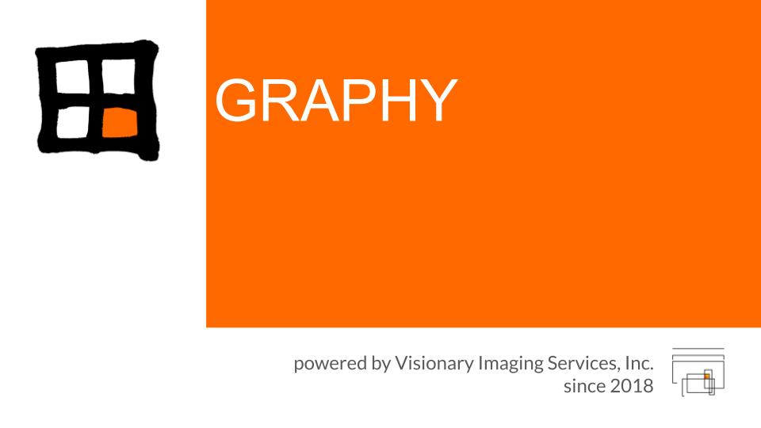

# はじめに

!!! note "このマニュアルは作成中です"
    章立てを先に公開しています。各ページの内容は順次追加します。
    それまでの間、もっとも詳しい資料は
    [リポジトリの README](https://github.com/tatsunidas/GRAPHY-Next) です。
    前身である [GRAPHY classic のマニュアル](https://tatsunidas.github.io/GRAPHY/)
    も、用語や解析の考え方については参考になります。

## GRAPHY-Next とは

**GRAPHY-Next** は、DICOM 画像の表示・解析を行う研究用のワークステーションです。
Java Swing の DICOM ワークステーション **GRAPHY**（classic）を Web 技術で作り直したもので、
Spring Boot のバックエンドと React のフロントエンドで構成されています。

!!! warning "研究用途・非診断"
    Not for diagnostic use. 診断目的での使用はできません。

## 2 つのモード

同じ UI が、2 つの構成で動きます。

| モード | 構成 | 画像の置き場所 |
|---|---|---|
| **スタンドアロン** | Electron デスクトップアプリ | ローカル（H2 ＋ ファイルシステム） |
| **Web** | ブラウザ ＋ バックエンド（BFF） | 外部 PACS（DICOMweb で参照） |

スタンドアロン版は、DICOM 受信（SCP）からすべてのビューア機能までオフラインで完結します。
Web 版は画像を自分では保管せず、dcm4chee などの PACS にあるスタディを参照表示します。

現在アクティブなモードは、画面のステータスバーと **環境設定 ＞ 情報** で確認できます。

## 主な機能

**画像ビューア**

- **2D ビューア** — スタック表示、W/L プリセット、シネ、輝度校正（HU / SUV）
- **MPR** — 直交 3 断面のリスライス（ガントリチルト対応）
- **Slicer** — 任意角オブリークのリスライス、セカンダリシリーズとして保存
- **Curved MPR** — 芯線に沿った 3 種の CPR（ストレッチ / ストレートン / 回転アンフォールド）
- **3D ビューア** — ボリューム / サーフェスレンダリング、シネマティックレンダリング、
  3D 計測・3D カット、芯線解析、内視鏡パス編集、ROI ↔ メッシュ変換

**解析・定量**

- 2D ROI の描画と管理、マスク塗り
- PET の SUV 校正、PET/CT などのフュージョンオーバーレイ
- テクスチャ解析（Radiomics、RadiomicsJ 連携）

**データ管理・通信**

- DICOM 保管庫、DIMSE（C-STORE SCP ほか）、DICOMweb、REST
- Query / Retrieve、リモート AE への送信、非 DICOM（動画等）の取り込み
- プラグイン機構、日本語 / 英語 UI

## 動作環境

配布物（インストーラ）にはバックエンド・Java ランタイム・ffmpeg を同梱しているため、
デスクトップ版に追加のインストールは必要ありません。

| OS | 対応 |
|---|---|
| Windows | 10 以降 |
| macOS | Apple Silicon / Intel |
| Linux | AppImage が動作するディストリビューション |

Web 版をご自分で立ち上げる場合は JDK 21 が必要です。詳しくは
[インストールと起動](install.md)をご覧ください。

## ライセンス

GRAPHY-Next は AGPL-3.0 で公開しています。商用ライセンスについては
[README](https://github.com/tatsunidas/GRAPHY-Next) をご参照ください。
